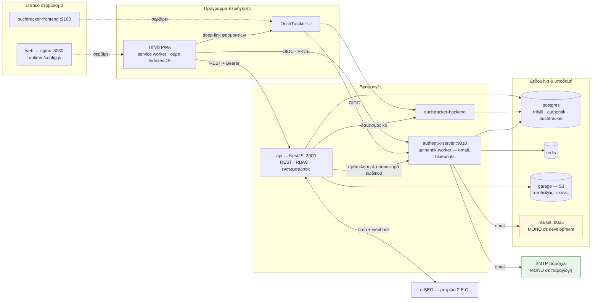
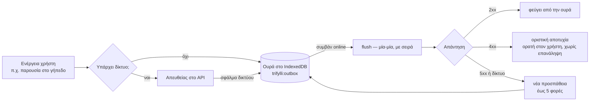
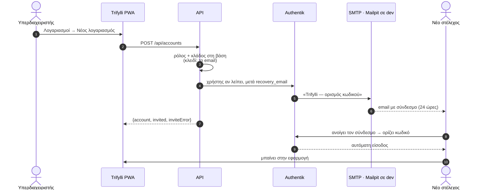
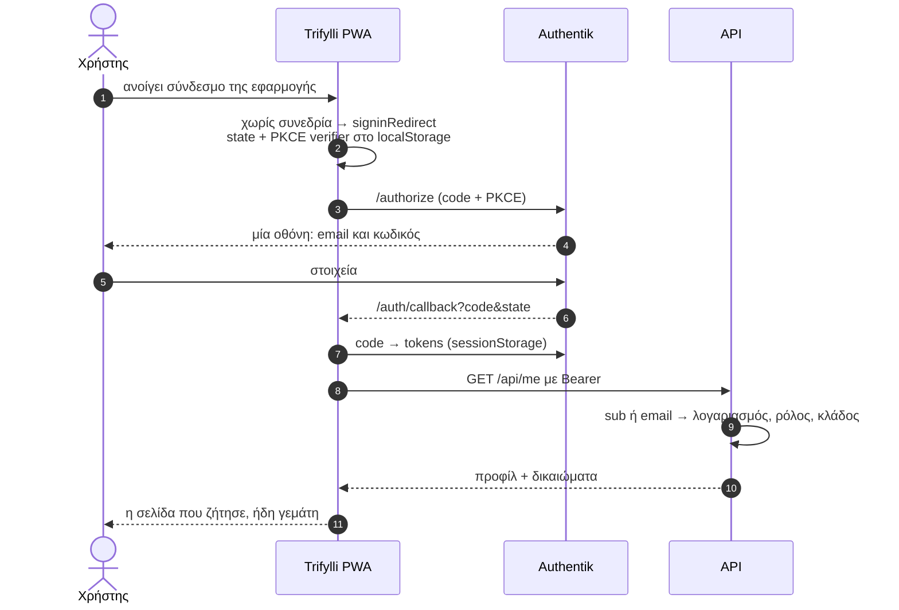
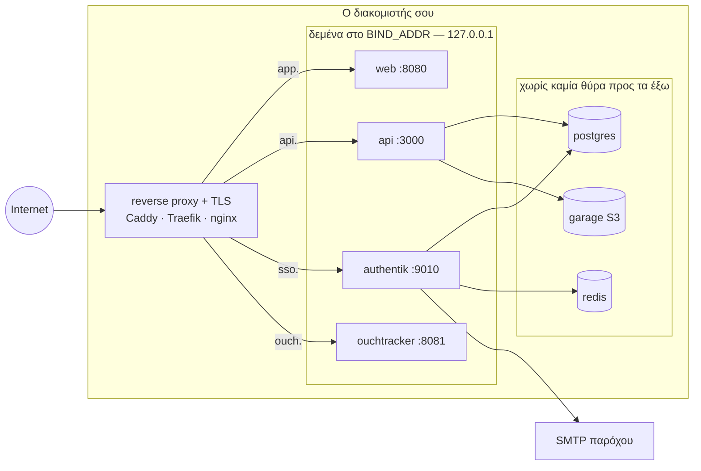

# Trifylli

Σύστημα διαχείρισης Τοπικού Τμήματος του Σώματος Ελληνικού Οδηγισμού: κλάδοι,
μέλη, υλικό, δράσεις, συγκεντρώσεις, συμβούλια και οικονομικά — με PWA που
δουλεύει χωρίς δίκτυο στην κατασκήνωση.

Οι προδιαγραφές είναι στο [`plan.md`](plan.md).

---

## Γρήγορη εκκίνηση

```bash
pnpm install
cp apps/api/.env.example apps/api/.env
pnpm infra:up                  # Postgres, Redis, Mailpit, Authentik, Garage S3
pnpm infra:sso                 # blueprints (OIDC, κωδικός, εμφάνιση) + χρήστες ανάπτυξης
pnpm db:migrate                # δημιουργεί το σχήμα
pnpm db:seed                   # δεδομένα ενός πλήρους Τοπικού
pnpm dev                       # API :3000 · PWA :9000
```

Το `pnpm infra:sso` τυπώνει τις τιμές για τα `.env`. Η πρώτη εκκίνηση του
Authentik θέλει λίγα λεπτά για migrations.

* API & Swagger: <http://localhost:3000/api/docs>
* PWA: <http://localhost:9000>
* Authentik: <http://localhost:9010>
* **Mailpit** (όλα τα email της ανάπτυξης): <http://localhost:8025>

### Σύνδεση

Με το Authentik στημένο, η PWA κάνει κανονικό OIDC login. Οι χρήστες ανάπτυξης
(κωδικός `trifylli-dev`):

| Email | Ρόλος |
| :--- | :--- |
| `admin@trifylli.local` | Υπερδιαχειριστής |
| `seed-0000@trifylli.local` | Διαχειριστής Αστεριών |
| `seed-0010@trifylli.local` | Διαχειριστής Πουλιών |
| `seed-0020@trifylli.local` | Διαχειριστής Οδηγών |
| `seed-0030@trifylli.local` | Διαχειριστής Μεγάλων Οδηγών |

### Χωρίς Authentik

Για γρήγορη δουλειά στο API, το `DEV_AUTH_BYPASS=true` παρακάμπτει την επικύρωση
token. Η συνεδρία δένει πάλι με **υπαρκτό λογαριασμό** μέσω email:

```bash
curl -H 'x-dev-email: seed-0010@trifylli.local' http://localhost:3000/api/me
```

Άγνωστο email απορρίπτεται με 403 όπως και σε production — το bypass παρακάμπτει
την ταυτοποίηση, όχι την εξουσιοδότηση. Στην PWA το αντίστοιχο είναι να αφήσεις
κενό το `VITE_OIDC_CLIENT_ID` και να ορίσεις `VITE_DEV_EMAIL`.

Το bypass απορρίπτεται στην εκκίνηση όταν `NODE_ENV=production`.

---

## Αρχιτεκτονική

Μία στοίβα, τρία «προϊόντα» που μοιράζονται ταυτότητα και βάση: το Trifylli
(API + PWA), το OuchTracker (φαρμακεία) και το Authentik που απαντά **μόνο**
στο «ποιος είσαι».



Σε **development** τα email πάνε στο Mailpit και δεν φεύγει τίποτα προς τα έξω·
σε **παραγωγή** τη θέση του παίρνει ο πραγματικός SMTP (`SMTP_*`) και το
`migrate` service τρέχει τα Prisma migrations πριν ξεκινήσει το API.

---

## Δομή

```
apps/
  api/            NestJS + Prisma — REST API, RBAC, ενσωματώσεις
  web/            Quasar (Vue 3) PWA — offline-first client
packages/
  shared/         Enums, ελληνικές ετικέτες, κανόνες πρόσβασης — κοινά σε API & PWA
infra/
  authentik/
    trifylli-oidc.yaml       Blueprint: provider, εφαρμογή, ροές σύνδεσης/αποσύνδεσης
    trifylli-recovery.yaml   Blueprint: ροή «ορισμός & επαναφορά κωδικού»
    trifylli-branding.yaml   Blueprint: λογότυπο, φόντο και ΟΛΟ το custom CSS
    ouchtracker-oidc.yaml    Blueprint: η δεύτερη OIDC εφαρμογή (SSO)
    branding/                logo.svg, favicon.svg, clover-pattern.webp
    email-templates/         Ελληνικά πρότυπα email (mount στο /templates)
    setup.sh                 Εφαρμογή blueprints + χρήστες ανάπτυξης
  garage/         Ρυθμίσεις και αρχικοποίηση του S3 (layout, bucket, key)
  postgres/init/  Δημιουργία των βάσεων Authentik/OuchTracker στο πρώτο boot
```

Το `packages/shared` είναι ο λόγος που το UI δεν δείχνει ποτέ κουμπί που ο
server θα απορρίψει: η συνάρτηση `can()` είναι **ο ίδιος κώδικας** και στις δύο
πλευρές. Το API την επιβάλλει, η PWA την χρησιμοποιεί για να κρύβει ενέργειες.

---

## Εντολές

| Εντολή | Τι κάνει |
| :--- | :--- |
| `pnpm dev` | API και PWA παράλληλα, με hot reload |
| `pnpm build` | Χτίζει shared → API → PWA (τοπολογική σειρά) |
| `pnpm typecheck` | TypeScript σε όλα τα πακέτα |
| `pnpm test` | Unit tests (vitest) |
| `pnpm db:migrate` | Prisma migration σε development |
| `pnpm db:seed` | Idempotent seed — τρέχει ξανά χωρίς διπλότυπα |
| `pnpm db:studio` | Prisma Studio |
| `pnpm infra:up` / `infra:down` | Υποδομές σε Docker (Postgres, Redis, **Mailpit**, Authentik, Garage) |
| `pnpm infra:sso` | Εφαρμόζει τα blueprints του Authentik και φτιάχνει χρήστες ανάπτυξης |

Πλήρης στοίβα σε containers: `docker compose --profile full up -d`.

---

## Αποφάσεις που αξίζει να ξέρεις

**Διαθεσιμότητα υλικού = μέγιστη ταυτόχρονη δέσμευση, όχι άθροισμα.**
Δύο δεσμεύσεις μέσα στο ίδιο παράθυρο που δεν επικαλύπτονται μεταξύ τους (π.χ.
δύο διαφορετικά σαββατοκύριακα) χρησιμοποιούν το ίδιο υλικό διαδοχικά. Άθροιση
θα εμφάνιζε τις σκηνές εξαντλημένες χωρίς λόγο. Ο υπολογισμός γίνεται με sweep
line στο [`availability.ts`](apps/api/src/modules/yliko/availability.ts). Η
εγγραφή γίνεται σε `Serializable` συναλλαγή, ώστε δύο στελέχη που δεσμεύουν
ταυτόχρονα να μην περνούν και τα δύο τον έλεγχο.

**Στο παρουσιολόγιο κερδίζει η ώρα καταγραφής στη συσκευή, όχι η ώρα άφιξης.**
Η ουρά της PWA μπορεί να αδειάσει ώρες μετά. Χωρίς αυτόν τον κανόνα, μια
καθυστερημένη offline εγγραφή θα έσβηνε διόρθωση που έγινε online στο μεταξύ.
Βλ. [`merge.ts`](apps/api/src/modules/parousiologio/merge.ts).

**Οι γραφές δεν περνούν από τον service worker.** Τις διαχειρίζεται η ουρά της
εφαρμογής, που ξέρει τη σημασιολογία τους (`recordedAt`, σειρά, ποια 4xx δεν
αξίζει να ξαναδοκιμαστούν). Ένα background sync στο επίπεδο του SW θα τις
έστελνε τυφλά.



Το UI δείχνει πάντα πόσες εγγραφές εκκρεμούν και ποιες απέτυχαν: μια ουρά που
κρύβεται είναι χειρότερη από καθόλου ουρά.

**Το Authentik αυθεντικοποιεί, η βάση εξουσιοδοτεί.** Τα Authentik groups δεν
δίνουν δικαιώματα: θα ήταν δεύτερη πηγή αλήθειας δίπλα στους λογαριασμούς που
ορίζει ο υπερδιαχειριστής, και οι δύο θα ξέφευγαν. Ούτε το e-SEO δίνει πρόσβαση
— ο συγχρονισμός μητρώου δεν αγγίζει ποτέ το `accountRole`, ούτε τοποθετήσεις σε
υποομάδες (το e-SEO δεν ξέρει εξάδες) ούτε πληρωμές καταχωρημένες τοπικά.

**Soft deletes παντού.** Παρουσιολόγια, πρακτικά και δεσμεύσεις δεν διαγράφονται
σκληρά: ένα ιστορικό που «εξαφανίζεται» δεν εξηγείται σε κανέναν.

---

## Λογαριασμοί και πρόσβαση

Το Τοπικό λειτουργεί με **πέντε λογαριασμούς**: έναν υπερδιαχειριστή και έναν
διαχειριστή ανά κλάδο.

| Λογαριασμός | Τι βλέπει | Τι κάνει |
| :--- | :--- | :--- |
| Υπερδιαχειριστής | Όλους τους κλάδους και το Τοπικό | Τα πάντα, μαζί με τη δημιουργία λογαριασμών |
| Διαχειριστής Κλάδου | **Μόνο** τον κλάδο του | Ημερολόγιο, συγκεντρώσεις, μέλη, πρόοδο, δράσεις, συμβούλια και υλικό του κλάδου του |

Εκτός εμβέλειας του διαχειριστή κλάδου μένουν η κεντρική αποθήκη, τα οικονομικά,
οι ενσωματώσεις, τα συμβούλια Τοπικού και οι λογαριασμοί.

**Τα μέλη και τα στελέχη δεν είναι λογαριασμοί.** Είναι εγγραφές μητρώου
(`MemberKind: MELOS | STELEXOS`) — συμμετέχουν σε παρουσιολόγια, πρόοδο και
συνδρομές αλλά δεν μπαίνουν στην εφαρμογή. Η διάκριση παιδί/στέλεχος παραμένει
γιατί τη χρειάζονται τα στατιστικά κατασκήνωσης.

Τους λογαριασμούς τους φτιάχνει ο υπερδιαχειριστής στο `Λογαριασμοί`
(`POST /api/accounts`). Το **email** είναι το κλειδί: όταν κάποιος συνδεθεί μέσω
Authentik με αυτό, δένει με τον λογαριασμό. Αν το άτομο υπάρχει ήδη στο μητρώο,
προάγεται αντί να δημιουργηθεί διπλότυπο — ο λογαριασμός είναι πρόσβαση πάνω σε
υπαρκτό πρόσωπο. Η ανάκληση αφαιρεί μόνο την πρόσβαση· το ιστορικό μένει.

Το πρώτο στήσιμο λύνεται με `SUPER_ADMIN_EMAIL`: ο πρώτος που συνδέεται με αυτό
γίνεται υπερδιαχειριστής. Είναι το μοναδικό σημείο όπου ρόλος έρχεται από το
περιβάλλον. Το `GET /api/setup-check` δείχνει τι λείπει.

### Πρόσκληση και κωδικός

**Το Trifylli δεν βλέπει ποτέ κωδικό** — ούτε προσωρινό. Η δημιουργία
λογαριασμού ζητά από το Authentik να στείλει **σύνδεσμο ορισμού κωδικού** στο
email του ατόμου· τον κωδικό τον διαλέγει μόνο του. Έτσι κανείς δεν χρειάζεται
να επινοήσει κωδικό, να τον γράψει σε chat ή να τον πει σε συγκέντρωση.



Αν η αποστολή αποτύχει (π.χ. χωρίς `AUTHENTIK_API_TOKEN`), ο λογαριασμός
**δημιουργείται ούτως ή άλλως** και η απάντηση το λέει στο `inviteError` — η
εναλλακτική θα ήταν ο υπερδιαχειριστής να ξαναπροσπαθήσει και να πάρει «υπάρχει
ήδη λογαριασμός».

Το κουμπί **✉** δίπλα σε κάθε λογαριασμό (`POST /api/accounts/:id/invite`)
ξαναστέλνει τον ίδιο σύνδεσμο: για πρόσκληση που χάθηκε και για επαναφορά
κωδικού. Ο χρήστης μπορεί επίσης να ζητήσει μόνος του «Ξέχασα τον κωδικό» από
την οθόνη σύνδεσης — ίδια ροή, άλλη αφετηρία.

> **Προσοχή σε μια σιωπή που μοιάζει με σφάλμα.** Το «Ξέχασα τον κωδικό» λέει
> «Check your Inbox» ακόμη κι όταν το email **δεν** αντιστοιχεί σε χρήστη του
> Authentik (`pretend_user_exists`), ώστε η δημόσια οθόνη να μη γίνεται εργαλείο
> ανακάλυψης διευθύνσεων. Λογαριασμοί φτιαγμένοι πριν υπάρξει η πρόσκληση δεν
> έχουν χρήστη στο Authentik: γι' αυτούς δεν θα έρθει ποτέ email — στείλε τους
> πρόσκληση από το ✉, που δημιουργεί τον χρήστη και μετά στέλνει τον σύνδεσμο.
> Το εικονίδιο ⏳ στους Λογαριασμούς δείχνει ακριβώς αυτούς που δεν έχουν μπει
> ποτέ.

### Email

| | development | παραγωγή |
| :--- | :--- | :--- |
| SMTP | `mailpit` (υπηρεσία του compose) | πραγματικός πάροχος, `SMTP_*` |
| Πού φτάνουν | <http://localhost:8025> — τίποτα δεν φεύγει έξω | στον παραλήπτη |
| Υποχρεωτικά | κανένα (defaults) | `SMTP_HOST`, `SMTP_FROM` — αλλιώς η στοίβα δεν σηκώνεται |

Τα μηνύματα τα στέλνει ο **worker** του Authentik, με δικά μας ελληνικά πρότυπα
([`infra/authentik/email-templates`](infra/authentik/email-templates)) αντί για
τα αγγλικά του Authentik, που μιλούν για «your authentik account» — ο
παραλήπτης όμως δεν ξέρει καν ότι υπάρχει Authentik. Είναι σκόπιμα **χωρίς
εικόνες**: τα URL των αρχείων του Authentik είναι υπογεγραμμένα και λήγουν, και
οι πελάτες email μπλοκάρουν ούτως ή άλλως τις εικόνες — η ταυτότητα γίνεται με
χρώμα και τυπογραφία.

Έλεγχος ότι δουλεύει ο αγωγός, χωρίς να πειραχτεί λογαριασμός:

```bash
docker compose exec authentik-worker ak test_email kapoios@example.gr
```

### Η ροή σύνδεσης

Authorization Code + **PKCE**, δημόσιος client χωρίς secret — ό,τι μπει στο
bundle μιας PWA είναι δημόσιο ούτως ή άλλως.



**Πού μένει τι.** Τα **tokens** στο `sessionStorage`: κλείνοντας την καρτέλα η
συνεδρία τελειώνει, που είναι το σωστό για τον κοινόχρηστο υπολογιστή της
Εστίας. Το **state** της αίτησης (με το PKCE verifier) και ο προορισμός
επιστροφής στο `localStorage`, γιατί η επιστροφή δεν προσγειώνεται πάντα στην
καρτέλα που ξεκίνησε: ο σύνδεσμος «ορισμός κωδικού» ανοίγει από το email, άρα
σε **άλλη** καρτέλα — με `sessionStorage` το callback έσκαγε με «No matching
state found in storage». Το state είναι βραχύβιο, καθαρίζεται μόλις
καταναλωθεί, και χωρίς τον authorization code δεν αξίζει τίποτα.

Κι αν παρ' όλα αυτά λείπει (άλλος browser, καθαρισμένα δεδομένα), η σελίδα
επιστροφής **δεν** δείχνει αδιέξοδο: ζητά νέα αίτηση σύνδεσης και, με ζωντανή
συνεδρία στο Authentik, ο χρήστης γυρίζει αμέσως πίσω χωρίς να γράψει τίποτα —
μία φορά ανά καρτέλα, ώστε να μην μπορεί να γίνει βρόχος.

Όσο η καρτέλα είναι ανοιχτή, η ανανέωση γίνεται σιωπηλά με κρυφό iframe.

**Η σύνδεση δεν διακόπτει τη ροή.** Ο χρήστης που πατά έναν σύνδεσμο χωρίς
συνεδρία δεν βλέπει ενδιάμεση οθόνη με κουμπί «σύνδεση»: δεν διάλεξε να βρεθεί
εκεί, οπότε η ανακατεύθυνση ξεκινά αμέσως. Επιστρέφει στη σελίδα που ζήτησε, με
τα δεδομένα ήδη φορτωμένα. Με ζωντανή συνεδρία στο Authentik, η επιστροφή στην
εφαρμογή γίνεται **χωρίς κανένα κλικ**.

**Το Authentik φοριέται στα χρώματα της εφαρμογής.** Ίδιο λογότυπο, ίδιο
πράσινο, ίδιες γωνίες και σκιές με τις κάρτες της PWA, ανοιχτό θέμα, μοτίβο
τριφυλλιού στο φόντο, και όνομα και κωδικός σε **μία** οθόνη αντί για δύο. Όλα
ζουν στο [`trifylli-branding.yaml`](infra/authentik/trifylli-branding.yaml) —
brand **και** ολόκληρο το custom CSS — ώστε να εφαρμόζονται μόνα τους και σε
παραγωγή. Τρεις λεπτομέρειες που κόστισαν ώρα, γραμμένες και στα σχόλια του
blueprint:

* τα `branding_logo`/`branding_favicon` δέχονται **σκέτο όνομα αρχείου**·
  απόλυτη διαδρομή απορρίπτεται («Absolute paths are not allowed»),
* από το 2026.x το αρχείο `/web/dist/custom.css` **δεν φορτώνεται** — το CSS
  ζει στο πεδίο `branding_custom_css` και ενίεται και μέσα στα shadow roots,
* η εικόνα φόντου ζωγραφίζεται στο `body::before` και **μόνο** πάνω από
  `35rem` πλάτος· στο κινητό το Authentik τη ρίχνει επίτηδες.

> Οι ετικέτες της φόρμας μένουν αγγλικές: το Authentik 2026.8 δεν διαθέτει
> ελληνική μετάφραση (ar, bg, cs, de, en, es, fi, fr, it, ja, ko, nb, nl, pl,
> pt-BR, ru, tr, zh). Ελληνικά είναι ό,τι ορίζουμε εμείς — τίτλοι ροών, πεδία
> κωδικού, email· τα υπόλοιπα θα χρειάζονταν μετάφραση upstream.

Ένα σημείο αξίζει εξήγηση, γιατί μοιάζει με παράλειψη και δεν είναι: **δεν
ζητάμε `offline_access`**, άρα δεν εκδίδεται refresh token.

Το OIDC ορίζει ότι το `offline_access` απαιτεί ρητή συγκατάθεση, και το Authentik
το επιβάλλει: όποτε το δει, προσθέτει consent stage — δηλαδή μια οθόνη «Continue»
στη μέση της σύνδεσης. Δεν ρυθμίζεται· είναι στον κώδικα του authorize endpoint.

Για ένα εργαλείο που το Τοπικό φτιάχνει για τον εαυτό του, μια οθόνη που ζητά
άδεια «από τον χρήστη προς την εφαρμογή» δεν προσθέτει τίποτα — μόνο τριβή. Οπότε
το `offline_access` φεύγει και η ροή εξουσιοδότησης (`trifylli-authorization`)
μένει **κενή**: καμία συγκατάθεση, καμία ενδιάμεση οθόνη, ποτέ.

Το κόστος καλύπτεται: η ανανέωση γίνεται με κρυφό iframe και `prompt=none` πάνω
στη συνεδρία του Authentik, που είναι αόρατη για τον χρήστη. Το μόνο σενάριο που
θα χρειαζόταν refresh token είναι αν η εφαρμογή και το Authentik ζούσαν σε
**διαφορετικά registrable domains** — τότε το cookie δεν ταξιδεύει στο iframe και
η ανανέωση αποτυγχάνει. Σε subdomains του ίδιου domain (`sso.example.gr` και
`app.example.gr`) δουλεύει κανονικά.

Η προεπιλεγμένη ροή του Authentik μένει άθικτη, γιατί είναι κοινή για κάθε
εφαρμογή του.

### Αποσύνδεση

Η αποσύνδεση τερματίζει και τη συνεδρία του **Authentik**, όχι μόνο την τοπική.
Δεν είναι λεπτομέρεια: αφού η σύνδεση είναι αδιάκοπη, μια αποσύνδεση που αφήνει
ζωντανή τη συνεδρία του IdP θα έβαζε τον επόμενο χρήστη του κοινόχρηστου
υπολογιστή μέσα ως τον προηγούμενο.

Δεν χρησιμοποιείται το `end_session` endpoint, παρότι είναι το τυπικό: το
Authentik του προσθέτει σταθερά μια οθόνη «You've logged out…» με κουμπιά
(`SessionEndStage`, χωρίς ρύθμιση παράκαμψης). Η εφαρμογή πηγαίνει αντ' αυτού
απευθείας στη ροή `trifylli-invalidation`, που έχει δύο στάδια: τερματισμό
συνεδρίας και επιστροφή εδώ.

Η επιστροφή γίνεται με **Redirect Stage** και όχι με `?next=`: ο executor
απορρίπτει absolute URLs ως προστασία από open redirect, οπότε το `next` δεν
μπορεί να δείξει σε άλλο origin. Το URL της εφαρμογής ορίζεται στο context του
blueprint (`TRIFYLLI_APP_URL`).

Το `sub` του Authentik είναι σταθερό και αδιαφανές (`hashed_user_id`). Το email
είναι το κλειδί **πρώτης** αντιστοίχισης· μετά το πρώτο login ο χρήστης
εντοπίζεται από το `sub`, ώστε μια αλλαγή email στο Authentik να μην κλειδώνει
κανέναν έξω.

Δύο ξεχωριστές αποτυχίες, δύο διαφορετικές απαντήσεις: χωρίς **συνεδρία** ο
χρήστης πάει για login· με έγκυρο token αλλά χωρίς **λογαριασμό** βλέπει «δεν
έχετε πρόσβαση», γιατί το να ξανασυνδεθεί δεν πρόκειται να βοηθήσει.

Τα φίλτρα **τέμνονται** πάντα με την εμβέλεια: ο διαχειριστής Πουλιών που ζητά
ρητά `?kladosType=ODIGOI` παίρνει κενή λίστα, όχι σφάλμα.

---

## Ενσωματώσεις

Και οι δύο είναι προαιρετικές — χωρίς ρύθμιση τα σχετικά endpoints απαντούν 503
και η υπόλοιπη εφαρμογή δουλεύει κανονικά.

**OuchTracker** (φαρμακεία): μπαίνει με το **ίδιο** single sign-on. Στο Authentik
ορίζεται δεύτερη OIDC εφαρμογή (`ouchtracker`,
[`infra/authentik/ouchtracker-oidc.yaml`](infra/authentik/ouchtracker-oidc.yaml))·
το OuchTracker backend ανταλλάσσει το access token του Authentik με δικό του JWT
(`POST /api/auth/oidc`, επικύρωση μέσω JWKS) — δεν ταξιδεύει κανένα μυστικό
ανάμεσα στα δύο. Από το Trifylli, η σελίδα **Φαρμακεία** (ανά κλάδο και Τοπικό)
δείχνει τα kit με deep-links: ο χρήστης που είναι ήδη συνδεδεμένος περνά χωρίς
δεύτερο login. Ο **δανεισμός** φαρμακείου σε άλλον κλάδο ή στο Τοπικό κάνει και
φυσική ανάθεση του kit στο OuchTracker (αντιστοίχιση ατόμων μέσω email), με
αυτόματη επιστροφή στη λήξη (cron). Module: `pharmacies`.

> Ο ρόλος στο OuchTracker (ADMIN/CHECKER) αποφασίζεται στο provisioning από τη
> λίστα `OIDC_ADMIN_EMAILS` — το Authentik απαντά μόνο «ποιος είσαι», όπως και
> στο Trifylli. Μένει και τοπική σύνδεση email/κωδικού ως break-glass.

**e-SEO** (μητρώο): cron (`ESEO_SYNC_CRON`) και webhook με HMAC υπογραφή. Χωρίς
`ESEO_WEBHOOK_SECRET` το webhook είναι απενεργοποιημένο — ένα ανοιχτό webhook
είναι χειρότερο από κανένα. Άγνωστη ονομασία κλάδου αφήνει το μέλος χωρίς
τοποθέτηση και καταγράφει προειδοποίηση, αντί να μαντέψει.

---

## Παραγωγή

Μία στοίβα σηκώνει τα πάντα — Trifylli (API + PWA), OuchTracker (backend +
frontend) και τις κοινές υποδομές (Postgres, Redis, Authentik, Garage S3) — από
το [`docker-compose.prod.yml`](docker-compose.prod.yml):

```bash
cp .env.prod.example .env.prod      # συμπλήρωσέ το με πραγματικά μυστικά
docker compose -f docker-compose.prod.yml --env-file .env.prod up -d --build
```

Όλα τα μυστικά είναι υποχρεωτικά (`${VAR:?}`): αν λείπει κάποιο, το compose
σταματά αντί να σηκώσει στοίβα με αδύναμα defaults. Το `migrate` service τρέχει
`prisma migrate deploy` και τερματίζει **πριν** ξεκινήσει το API· το OuchTracker
backend κάνει migrate + seed μόνο του στην εκκίνηση. Το OuchTracker μοιράζεται
τον ίδιο Postgres σε δική του βάση (`OUCHTRACKER_DB`, φτιάχνεται στο πρώτο boot
από το [`infra/postgres/init`](infra/postgres/init)).

**Ένα domain, υποτομείς.** Η στοίβα δεν περιλαμβάνει TLS/reverse proxy — τον
βάζει ο διαχειριστής μπροστά (Caddy/Traefik/nginx). Οι υπηρεσίες δένονται στο
`BIND_ADDR` (default `127.0.0.1`), ώστε να τις φτάνει μόνο ο τοπικός proxy και
ποτέ απευθείας το internet· Postgres/Redis/Garage δεν εκτίθενται καθόλου.

| Υποτομέας | Υπηρεσία | Θύρα (env) |
| :--- | :--- | :--- |
| `app.example.gr` | Trifylli PWA | `WEB_PORT` (8080) |
| `api.example.gr` | Trifylli API | `API_PORT` (3000) |
| `sso.example.gr` | Authentik (SSO) | `AUTHENTIK_PORT` (9010) |
| `ouch.example.gr` | OuchTracker — κάνει μόνο του proxy `/api` | `OUCHTRACKER_WEB_PORT` (8081) |



**Οι υποτομείς πρέπει να είναι του ίδιου registrable domain** με το Authentik:
αλλιώς ο browser διαχωρίζει το storage του κρυφού iframe και σπάνε η σιωπηλή
ανανέωση και το Single Logout.

**Οι ρυθμίσεις της PWA είναι runtime, όχι build-time.** Ο entrypoint του nginx
γράφει το `/config.js` από μεταβλητές περιβάλλοντος (`API_URL`, `OIDC_*`,
`OUCHTRACKER_URL`) σε κάθε εκκίνηση — η ίδια image δουλεύει σε κάθε περιβάλλον,
και η αλλαγή ενός URL είναι **restart, όχι rebuild**.

**Authentik για το πραγματικό domain.** Τα blueprints
([`trifylli-oidc.yaml`](infra/authentik/trifylli-oidc.yaml),
[`ouchtracker-oidc.yaml`](infra/authentik/ouchtracker-oidc.yaml)) έχουν localhost
redirect URIs για development. Για production όρισε στον πάροχο και την εφαρμογή:

* τα **redirect URIs** στους πραγματικούς υποτομείς (`…/auth/callback`,
  `…/auth/silent`, `…/`),
* το **`meta_launch_url`** της εφαρμογής στο δημόσιο URL — αλλιώς το Authentik
  πέφτει στο *πρώτο* redirect URI (ακριβώς αυτό σε στέλνει σε λάθος θύρα),
* τα contexts **`TRIFYLLI_APP_URL` / `OUCHTRACKER_APP_URL`** (επιστροφή μετά την
  αποσύνδεση).

Τα `OIDC_ISSUER` (backend) και `VITE_OIDC_AUTHORITY` (PWA) πρέπει να ταιριάζουν
**ακριβώς** με το δημόσιο URL του Authentik — είναι το `iss` του token. Το
`SUPER_ADMIN_EMAIL` δίνει τον πρώτο υπερδιαχειριστή, και το
`OUCHTRACKER_OIDC_ADMIN_EMAILS` ποιοι γίνονται ADMIN στο OuchTracker.

**Email — υποχρεωτικό.** `SMTP_HOST` και `SMTP_FROM` είναι `${VAR:?}`: χωρίς
αυτά η στοίβα δεν σηκώνεται. Σκόπιμα, γιατί η εναλλακτική είναι να το
ανακαλύψεις τη μέρα που κάποιος ξεχνά τον κωδικό του. Για 587 άσε
`SMTP_USE_TLS=true` (STARTTLS), για 465 βάλε `SMTP_USE_SSL=true` και
`SMTP_USE_TLS=false` — ποτέ και τα δύο. Ο αποστολέας θέλει domain με SPF/DKIM
στον πάροχο, αλλιώς τα μηνύματα πάνε για spam.

**Πρόσκληση λογαριασμών.** Το `AUTHENTIK_API_TOKEN` (Authentik → *Directory →
Tokens*, σε λογαριασμό με δικαίωμα διαχείρισης χρηστών) είναι αυτό που επιτρέπει
στο API να φτιάχνει χρήστες και να στέλνει συνδέσμους κωδικού. Χωρίς αυτό οι
λογαριασμοί δημιουργούνται κανονικά, αλλά κανένα email δεν φεύγει.

**Object storage (Garage).** Αποδείξεις ταμείου και εικόνες markdown πάνε σε
S3-συμβατό Garage, μέσα από το backend με guards· το `garage-init` φτιάχνει
layout + bucket + key (idempotent) στο πρώτο boot.

> Για πλήρη στοίβα **ανάπτυξης** (μαζί με OuchTracker στο `:9100`):
> `docker compose --profile full up -d --build`. Τα URLs/μυστικά έρχονται από το
> `.env`.

---

## Ασφάλεια

Τι επιβάλλεται πού — και τι μένει στον διαχειριστή του server, γιατί δεν μπορεί
να μπει μέσα σε container.

### Ταυτότητα

* **Ο δεσμός χρήστη ↔ λογαριασμού είναι σταθερός, όχι το email.** Στην πρόσκληση
  το API γράφει στον χρήστη Authentik το attribute `trifylli_account_id`· ένα
  scope mapping το βγάζει στο token και το API δένει με αυτό πρώτα
  ([`user-directory.service.ts`](apps/api/src/common/auth/user-directory.service.ts)).
  Το email μένει εφεδρεία για λογαριασμούς που προϋπήρχαν — γι' αυτό είναι
  **read-only** για τον χρήστη στο Authentik (`trifylli-security.yaml`).
* **Brute force**: reputation policy στη ροή σύνδεσης — πέντε αποτυχίες από μια
  IP και η ροή αρνείται για 24 ώρες. Το API μετρά ανά IP μόνο αν ξέρει πόσοι
  proxies μεσολαβούν (`TRUST_PROXY_HOPS`, ποτέ `true`).
* **MFA**: στην παραγωγή (`AUTHENTIK_MFA_MODE=configure`) όποιος δεν έχει
  authenticator στήνει TOTP στην πρώτη σύνδεση. Στο dev παρακάμπτεται.
* **Κωδικοί**: ≥ 12 χαρακτήρες, zxcvbn ≥ 3, έλεγχος Have I Been Pwned
  (k-anonymity — ο κωδικός δεν φεύγει ποτέ). Το Trifylli δεν βλέπει κωδικό.
* **Το API μιλά στο Authentik ως service account** με πέντε δικαιώματα (χρήστης:
  δημιουργία/ανάγνωση/αλλαγή/επαναφορά, ανάγνωση email stage) — όχι superuser.
  Το token το φτιάχνει το blueprint από το `AUTHENTIK_API_TOKEN`.
* Το `SUPER_ADMIN_EMAIL` κάνει bootstrap **μόνο** όταν δεν υπάρχει κανένας
  υπερδιαχειριστής· η ανάκληση δεν αναιρείται από το περιβάλλον.

### Browser

* **CSP** από το nginx της PWA, αποδίδεται στον entrypoint με τα origins του API
  και του Authentik: `script-src 'self'` (κανένα inline script — το SLO είναι
  εξωτερικό `/slo.js`), `object-src 'none'`, `frame-ancestors 'none'` παντού
  εκτός από το `/auth/frontchannel-logout`, που επιτρέπει **μόνο** το Authentik.
  Μαζί: `nosniff`, `Referrer-Policy`, `Permissions-Policy`, HSTS.
* **Single Logout μόνο από το δικό μας Authentik**: το `iss` ελέγχεται πριν
  σηκωθεί το σήμα — αλλιώς κάθε ξένο site με ένα iframe θα αποσυνδέει όλους.
* **Η αποσύνδεση σβήνει τα δεδομένα**, όχι μόνο τα tokens: cache του service
  worker για το API, IndexedDB cache, ουρά. Στον κοινόχρηστο υπολογιστή της
  Εστίας ο επόμενος δεν βρίσκει μητρώο και ταμείο του προηγούμενου.
* Tokens σε `sessionStorage`, state/PKCE σε `localStorage` (βλ. ροή σύνδεσης).

### API

* JWT RS256 με `iss`/`aud`, JWKS με όριο· RBAC κοινός με το UI· `ValidationPipe`
  με `forbidNonWhitelisted`· `helmet`· CORS allowlist χωρίς credentials.
* Rate limiting: 300/λεπτό ανά IP καθολικά, 10/λεπτό προσκλήσεις, 30/λεπτό
  uploads και webhook.
* Uploads: τύπος από τα **πρώτα bytes** ([`sniff.ts`](apps/api/src/modules/files/sniff.ts)),
  όχι από ό,τι δηλώνει ο client· τα αρχεία σερβίρονται με `CSP: sandbox`.
* Webhook e-SEO: HMAC πάνω στα raw bytes, αγνόηση επαναλαμβανόμενης υπογραφής
  για 10΄, ένας συγχρονισμός τη φορά.
* **Audit log** (`audit_log`): λογαριασμοί, ταμείο, συνδρομές, διαγραφές
  αρχείων, χειροκίνητοι συγχρονισμοί — ποιος, τι, πότε. Δεν σβήνεται από την
  εφαρμογή.
* Swagger κλειστό σε παραγωγή (`SWAGGER_ENABLED`)· το `/health/ready` δεν
  εξηγεί γιατί απέτυχε η βάση· emails στα logs μασκαρισμένα.

### Containers & δεδομένα

* `no-new-privileges`, `cap_drop: ALL` στα δικά μας containers· το API με
  read-only root και `/tmp` σε μνήμη· το nginx με τις τέσσερις ικανότητες που
  χρειάζεται για να δέσει την :80 και να γίνει `nginx`.
* **Backup**: υπηρεσία `backup` — καθημερινό `pg_dump` όλων των βάσεων με
  περιστροφή στο volume `postgres-backups`.
* Στο development όλες οι θύρες δένονται στο `127.0.0.1` (`DEV_BIND_ADDR`).

### Τι μένει σε σένα (δεν μπαίνει σε container)

1. **TLS + HSTS στον reverse proxy.** Το HSTS που στέλνει η PWA αγνοείται πάνω
   από http· ο proxy το κάνει πραγματικό.
2. **Allowlist για το admin UI του Authentik** (`sso.<domain>/if/admin/`). Π.χ.
   Caddy: `@admin path /if/admin/* ... remote_ip 1.2.3.4` → `respond 403`. Ο
   `akadmin` με MFA, πάντα.
3. **Το volume `postgres-backups` να φεύγει από τον server** (rclone/restic).
   Backup στον ίδιο δίσκο σώζει από λάθος `DELETE`, όχι από χαμένο δίσκο.
4. **Περιστροφή μυστικών**: `AUTHENTIK_API_TOKEN` (νέα τιμή + restart — το
   blueprint ξαναγράφει το token), `ESEO_REFRESH_TOKEN` όταν ο Keycloak τον
   περιστρέψει (το log προειδοποιεί), κωδικός OuchTracker.
5. `pnpm audit --prod` πριν από κάθε release. Δύο advisories μένουν συνειδητά:
   `deepmerge-ts` (μέσω `prisma` CLI, τρέχει μόνο στο `migrate`) και `js-yaml`
   (μέσω `@nestjs/swagger`, που είναι κλειστό σε παραγωγή).

---

## Χάρτης λειτουργιών

Κάθε λειτουργία ζει είτε **ανά κλάδο** (`/k/:klados/…`, ορατή στον διαχειριστή
του κλάδου) είτε στο **Τοπικό** (μόνο υπερδιαχειριστής) — πολλές και στα δύο, με
την ίδια σελίδα και διαφορετική εμβέλεια.

| Λειτουργία | Εμβέλεια | Τι κάνει |
| :--- | :--- | :--- |
| Ημερολόγιο / Συγκεντρώσεις | Κλάδος + Τοπικό | Προγραμματισμός, σχεδιασμός συγκέντρωσης, εξαγωγή PDF |
| Παρουσιολόγιο | Κλάδος | Παρουσίες με προτεραιότητα στην ώρα καταγραφής (offline-safe) |
| Μέλη / Μητρώο | Κλάδος + Τοπικό | Εγγραφές μελών & στελεχών, ιδιότητες & ρόλοι από e-SEO/πτυχία |
| Ατομική πρόοδος | Κλάδος | Υπόσχεση → μονοπάτια/πτυχία → κορυφές (ανά κλάδο) |
| Δράσεις | Κλάδος | Οργάνωση δράσεων με υλικό και συμμετοχές |
| Συμβούλια | Κλάδος + Τοπικό | Πρακτικά (markdown με εικόνες), συμβούλια στελεχών & Τοπικού |
| Υλικό / Αποθήκη | Κλάδος + Τοπικό | Απόθεμα, δεσμεύσεις (sweep-line διαθεσιμότητα), QR, βλάβες |
| Συνδρομές | Κλάδος + Τοπικό | Εισπράξεις με 4-stage pipeline μετρητών + δωρεές |
| Ταμείο | Κλάδος + Τοπικό | Έσοδα/έξοδα, υπόλοιπο, αποδείξεις (S3) |
| **Φαρμακεία** | Κλάδος + Τοπικό | Kit OuchTracker μέσω SSO, δανεισμός με φυσική ανάθεση |
| Λογαριασμοί / Ενσωματώσεις | Τοπικό | Διαχείριση πρόσβασης, OuchTracker & e-SEO |

Η πρόσβαση επιβάλλεται στον server με `can()` ([`packages/shared`](packages/shared));
η PWA χρησιμοποιεί τον **ίδιο** κώδικα για να κρύβει ό,τι θα απορριπτόταν.

---

## Κατάσταση

Υλοποιημένα: Phase 1–5 σε λειτουργικό επίπεδο — υποδομή, API με RBAC και λογική
δέσμευσης, PWA με όλες τις βασικές οθόνες, offline ουρά και service worker,
ταμείο/συνδρομές με αποθήκευση αρχείων σε Garage S3, και πλήρης ενσωμάτωση
OuchTracker (SSO + Φαρμακεία με δανεισμό) δοκιμασμένη απέναντι σε ζωντανή
εγκατάσταση. Ενοποιημένη στοίβα παραγωγής (βλ. [Παραγωγή](#παραγωγή)).

Ο κύκλος ζωής λογαριασμού είναι πλήρης: δημιουργία με **email πρόσκλησης**,
ορισμός κωδικού από τον ίδιο τον χρήστη, «ξέχασα τον κωδικό» από την οθόνη
σύνδεσης, επαναποστολή από τον υπερδιαχειριστή — με ελληνικά πρότυπα email και
Mailpit στην ανάπτυξη.

Δεν έχει γίνει ακόμη: επεξεργασία timeline μέσα από το UI (το API το υποστηρίζει
πλήρως), end-to-end tests, και δοκιμή του e-SEO απέναντι σε πραγματικά endpoints.

Το μοντέλο επιτρέπει **περισσότερους από έναν** διαχειριστές στον ίδιο κλάδο
(χρήσιμο για αναπληρωτή) και το UI το δηλώνει, χωρίς να το εμποδίζει.
